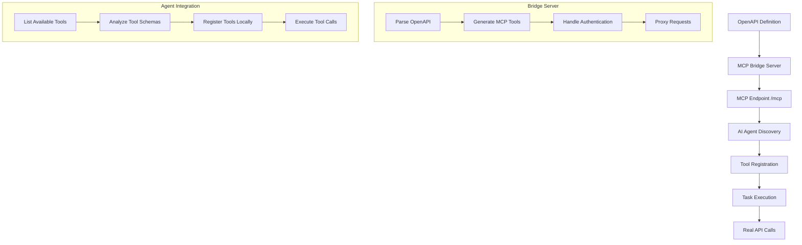

# OpenAPI-MCP Bridge Workflow Guide

## User Story: Agent Integration with OpenAPI Services

As an AI agent (like Claude), I want to dynamically discover and interact with REST APIs through MCP (Model Context Protocol) so that I can perform real-world tasks like purchasing tickets, managing events, or accessing data services without manual API integration.

## Workflow Overview



## Technical Implementation

### Phase 1: Standalone MCP Server Setup

#### 1.1 Server Configuration

Create a standalone server that exposes OpenAPI services as MCP tools:

```typescript
// server.js
import { MCPServer } from 'openapi-mcp-bridge';

const server = new MCPServer({
  definitionsDirectory: './api-definitions',
  port: 3000,
  mountPath: '/mcp',
  defaultCredentials: {
    username: process.env.API_USERNAME,
    password: process.env.API_PASSWORD
  },
  logging: { 
    consoleFallback: true 
  },
  mcpOptions: {
    serverName: 'api-bridge-server',
    serverVersion: '1.0.0'
  }
});

await server.start();
```

#### 1.2 API Definition Structure

```
api-definitions/
├── museum-api.yaml              # Primary OpenAPI definition
├── museum-api.custom.yaml       # Customization config (optional)
└── museum-api.enriched.json     # Generated cache (auto-created)
```

### Phase 2: Agent Discovery and Integration

#### 2.1 MCP Endpoint Discovery

The server exposes these endpoints:

- `POST /mcp` - Main MCP protocol endpoint (JSON-RPC 2.0)
- `GET /health` - Server health and tool count
- `GET /` - Server information and endpoint listing

#### 2.2 Tool Discovery Protocol

**Request**: List Available Tools
```json
POST /mcp
{
  "jsonrpc": "2.0",
  "method": "tools/list",
  "params": {},
  "id": 1
}
```

**Response**: Tool Definitions
```json
{
  "jsonrpc": "2.0",
  "result": {
    "tools": [
      {
        "name": "buy-tickets",
        "description": "Buy museum tickets",
        "inputSchema": {
          "type": "object",
          "properties": {
            "body": {
              "type": "object",
              "properties": {
                "ticketType": {
                  "type": "string",
                  "enum": ["event", "general"]
                },
                "ticketDate": {
                  "type": "string",
                  "format": "date"
                },
                "email": {
                  "type": "string",
                  "format": "email"
                }
              },
              "required": ["ticketType", "ticketDate", "email"]
            }
          }
        }
      }
    ]
  },
  "id": 1
}
```

### Phase 3: Agent Tool Registration

#### 3.1 Dynamic Tool Registration

The agent should:

1. **Discover Available Tools**
   ```javascript
   const toolsResponse = await fetch('/mcp', {
     method: 'POST',
     headers: { 'Content-Type': 'application/json' },
     body: JSON.stringify({
       jsonrpc: '2.0',
       method: 'tools/list',
       params: {},
       id: 1
     })
   });
   
   const { tools } = (await toolsResponse.json()).result;
   ```

2. **Register Tools Locally**
   ```javascript
   tools.forEach(tool => {
     registerTool(tool.name, {
       description: tool.description,
       parameters: tool.inputSchema,
       handler: async (params) => {
         return await callMCPTool(tool.name, params);
       }
     });
   });
   ```

3. **Create Tool Execution Handler**
   ```javascript
   async function callMCPTool(toolName, parameters) {
     const response = await fetch('/mcp', {
       method: 'POST',
       headers: { 'Content-Type': 'application/json' },
       body: JSON.stringify({
         jsonrpc: '2.0',
         method: 'tools/call',
         params: {
           name: toolName,
           arguments: parameters
         },
         id: Math.floor(Math.random() * 10000)
       })
     });
     
     return (await response.json()).result;
   }
   ```

### Phase 4: Task Execution Example

#### 4.1 Museum Ticket Purchase Workflow

**Scenario**: Agent needs to purchase a museum ticket for a user

1. **Tool Discovery**
   ```javascript
   // Agent discovers available tools
   const tools = await discoverTools('http://localhost:3000/mcp');
   // Found: buy-tickets, get-ticket-qr, list-events, etc.
   ```

2. **Task Planning**
   ```javascript
   // Agent analyzes user request: "Buy me a general admission ticket for tomorrow"
   const plan = {
     tool: 'buy-tickets',
     parameters: {
       body: {
         ticketType: 'general',
         ticketDate: '2024-07-09', // tomorrow
         email: 'user@example.com'
       }
     }
   };
   ```

3. **Execution**
   ```javascript
   // Agent executes the tool
   const result = await callMCPTool('buy-tickets', plan.parameters);
   
   // Response contains ticket details
   const ticketInfo = {
     ticketId: result.content[0].text.ticketId,
     confirmationCode: result.content[0].text.confirmationCode
   };
   ```

4. **Follow-up Actions**
   ```javascript
   // Agent can retrieve QR code
   const qrResult = await callMCPTool('get-ticket-qr', {
     ticketId: ticketInfo.ticketId
   });
   
   // Save or display QR code to user
   await saveQRCode(qrResult, './tickets/');
   ```

## Configuration Examples

### Environment Variables
```bash
# API Credentials
MUSEUM_API_USERNAME=your_username
MUSEUM_API_PASSWORD=your_password

# Server Configuration
MCP_SERVER_PORT=3000
MCP_MOUNT_PATH=/mcp

# Logging
LOG_LEVEL=info
```

### Custom Authentication Override
```yaml
# museum-api.custom.yaml
authenticationOverrides:
  - endpoint: "*"
    credentials:
      username: "${MUSEUM_API_USERNAME}"
      password: "${MUSEUM_API_PASSWORD}"

toolAliases:
  buyMuseumTickets: "purchase-museum-entry"
  
predefinedParameters:
  global:
    source: "ai-agent"
  endpoints:
    buy-tickets:
      channel: "web"
```

## Integration Patterns

### Pattern 1: Direct Integration
Agent directly connects to MCP server endpoint.

### Pattern 2: Proxy Integration
```typescript
// Agent uses a local proxy to manage multiple MCP servers
class MCPAggregator {
  private servers: Map<string, string> = new Map();
  
  addServer(name: string, endpoint: string) {
    this.servers.set(name, endpoint);
  }
  
  async aggregateTools() {
    const allTools = [];
    for (const [name, endpoint] of this.servers) {
      const tools = await this.discoverTools(endpoint);
      allTools.push(...tools.map(t => ({ ...t, source: name })));
    }
    return allTools;
  }
}
```

### Pattern 3: Context-Aware Integration
```typescript
// Agent selects appropriate tools based on context
class ContextAwareAgent {
  async selectTools(userIntent: string, availableTools: Tool[]) {
    // Use intent analysis to filter relevant tools
    const relevantTools = availableTools.filter(tool => 
      this.isRelevantToIntent(tool, userIntent)
    );
    
    return relevantTools;
  }
}
```

## Error Handling and Resilience

### Network Resilience
```javascript
async function resilientToolCall(toolName, params, maxRetries = 3) {
  for (let attempt = 1; attempt <= maxRetries; attempt++) {
    try {
      return await callMCPTool(toolName, params);
    } catch (error) {
      if (attempt === maxRetries) throw error;
      await delay(1000 * attempt); // Exponential backoff
    }
  }
}
```

### Tool Validation
```javascript
function validateToolCall(tool, parameters) {
  // Validate parameters against tool schema
  const validator = new JSONSchemaValidator(tool.inputSchema);
  const validation = validator.validate(parameters);
  
  if (!validation.valid) {
    throw new Error(`Invalid parameters: ${validation.errors.join(', ')}`);
  }
}
```

## Expected Outcomes

### For AI Agents
- **Dynamic API Discovery**: No hardcoded API integrations needed
- **Self-Describing Tools**: Tools come with complete schemas and documentation
- **Authentication Handling**: Credentials managed centrally by the bridge
- **Error Resilience**: Standardized error handling through MCP protocol

### For API Providers
- **Zero Integration Cost**: Existing OpenAPI specs work without modification
- **Centralized Security**: Authentication and rate limiting handled by bridge
- **Monitoring**: All API calls logged and monitored through bridge
- **Version Management**: API changes automatically reflected in tool definitions

### For System Operators
- **Observability**: Complete visibility into agent-to-API interactions
- **Security Control**: Centralized authentication and authorization
- **Scalability**: Bridge can handle multiple agents and APIs
- **Maintainability**: Configuration-driven, no code changes needed

## Future Enhancements

1. **Tool Composition**: Combine multiple API calls into complex workflows
2. **Smart Caching**: Cache API responses for improved performance
3. **Rate Limiting**: Intelligent rate limiting per agent/tool
4. **Analytics**: Usage analytics and optimization recommendations
5. **Auto-Discovery**: Automatic discovery of OpenAPI endpoints in networks

This workflow enables a future where AI agents can seamlessly integrate with any REST API through a standardized MCP interface, dramatically reducing integration complexity while maintaining security and observability.